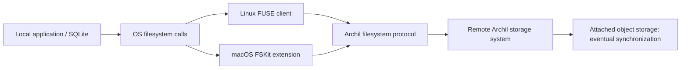

# Archil local mounts, SDKs and adapters: source review

Reviewed 2026-09-24. Primary objective: ordinary local SQLite and other applications accessing remotely stored files through a local mount. The remote SQL SDK is an optional additional path, not a requirement for SQLite on Archil.

## Downloaded material

All paths below are under `/Users/amcclenaghan/github/andymac4182/`:

| Download | Local directory | Version/revision |
| --- | --- | --- |
| Archil SDK and first-party adapters | `archil-sdk` | `f8c8ae5920a4450cfec2b0fb8d48cc8f42247923` |
| Published native filesystem client | `archil-native-review/package` | `@archildata/native` 0.8.40 |
| Third-party StorageSDK adapters | `archil-storagesdk-review` | `f488a3e1d2967900ca701169529304a335150e14` |
| Third-party ComputeSDK provider | `archil-computesdk-review` | `ea5be06ae016cf19ba547d4008b88119cf3748cc` |
| Installer and mounting docs | `archil-native-review` | fetched 2026-09-24; installer inspected, not executed |

Native package contains JS loaders, generated API declarations, README and compiled `.node` binaries for Linux x64/arm64 glibc and macOS arm64. It does **not** contain the Rust implementation of `archil-client-core` or its network protocol. No binaries were loaded, Archil account authenticated, storage created, or mounts installed.

## The actual local mount paths

This is a conceptual diagram assembled from documentation and installer evidence. The public SDK does not expose all internals of either mount implementation.

**Linux:** The installed `archil` CLI mounts an ordinary filesystem on the existing Linux kernel. Programs including SQLite run on that machine. The filesystem client performs remote storage access; SQLite does not become a remote SQL query. Default mounts have exclusive ownership of the disk; shared mounts require delegation management. A token or AWS IAM authenticates the mounting machine. The CLI integrates with fstab. Writes are buffered until fsync/background flush; the docs recommend `archil unmount` to drain before shutdown. [Linux mounting](https://docs.archil.com/mounting/linux), [FUSE compatibility](https://docs.archil.com/details/support).

**macOS:** A menu bar application signs in, lists disks and mounts native volumes under `/Volumes`. The installer explicitly requires macOS 26+ because the app depends on **FSKit**, and registers `ArchilMountExtension.appex` using `pluginkit`. This is not an NFS loopback mount or a macFUSE installation. CLI mounting uses an `archil://...` resource URL through `archil-mount`; that interface is documented as unstable. The docs position Mac mounts for debugging and warn about cloud round-trip latency. [macOS mounting](https://docs.archil.com/mounting/macos), [installer](https://archil.com/install).

The macOS docs say shared mode can write without manual checkout, with checkout improving performance. General sharing/Linux docs describe shared mode requiring delegation. This appears to be a platform/client policy difference, but the public code does not establish the implementation. Do not assume identical defaults or infer multi-host SQLite safety from the Mac wording.

**Containers:** A privileged container can install the Linux client and mount using the host kernel. Alternatively, mount once on the host and bind that directory into containers. With the bind approach, container processes share the underlying host mount rather than each becoming an independent Archil client. Kubernetes uses a CSI driver; its docs map RWO to exclusive ownership and RWX to `--shared`. Restricted platforms without mount permissions are directed to remote execution. Neither a Docker volume nor RWX itself establishes SQLite coordination. [Container mounting](https://docs.archil.com/mounting/containers), [CSI contract](https://docs.archil.com/reference/csi-driver). CSI implementation/chart internals were not downloaded or verified.

## How the local Node adapter connects

`packages/disk/src/disk.ts:1087` implements `Disk.mount()` by dynamically importing `@archildata/native`, then returning `ArchilClient.connect({region, diskName, authToken, ...})`. Despite the method name, this returns a **headless protocol client**, not an OS mount. Its native README explicitly distinguishes this from the FUSE CLI.

`packages/just-bash/src/ArchilFs.ts` implements just-bash's filesystem interface on that headless client:

1. Resolve paths component by component using `lookupInode`; retrieve inode metadata with `getAttributes`.
2. Read positioned byte ranges with `readInode`, chunking requests above `MAXIMUM_READ_SIZE`.
3. Create entries with `create`, write at offsets with `writeData`, rename/unlink via inode operations.
4. Page directory reads using `openDirectory` / `readDirectory` / `closeDirectory`.
5. `commands.ts` supplies checkout/checkin, delegation listing, directory cache expiry and mount-wide invalidation commands.

This means a local just-bash interpreter executes its emulated commands locally and forwards filesystem operations to Archil. It is distinct from `disk.exec`, which executes commands remotely.

The published native declarations describe cached attributes, names and file data; delegation tracking; a transaction scheduler batching writes; `sync()` flushing pending writes; `checkin()` syncing before releasing ownership; and `close()` syncing and releasing all delegations. Cache invalidation preserves dirty entries. These descriptions expose the intended contract, not audited Rust implementation evidence.

## What the other adapters do

| Adapter | Connection path | SQLite relevance |
| --- | --- | --- |
| `@archildata/just-bash` | Local interpreter -> native inode protocol client -> Archil service | Shows headless filesystem integration; not a SQLite VFS |
| `disk` object methods | HTTP requests to Archil's S3-compatible endpoint, with disk ID as bucket | Whole-object operations, not database byte locking |
| `@storagesdk/adapters/archil` | AWS S3 client with SigV4, path-style requests, Archil endpoint | Reuses generic S3 adapter; no local filesystem mount or SQLite locking |
| AI SDK, LangChain, Mastra | Framework wrappers -> shared `disk/internal/tools` specs | Read/write tools use object APIs; bash tool uses remote exec |
| Eve | Disk/workspace object operations plus remote exec, queued mounts | Agent session integration rather than local OS mount |
| `@computesdk/archil` | Ephemeral remote execution or persistent remote VM | Files transferred through remote commands/VM APIs; not raw filesystem protocol |
| `@archildata/sqlite` | SQL serialized into remote Node runner -> `POST /api/exec` | Convenience remote SQLite access, optional for local mounted SQLite |

StorageSDK's Archil adapter derives endpoints from region, sets `forcePathStyle: true`, strips the cloud prefix for signing region, and scopes branches using a bucket suffix. It connects to Archil's object API, not directly to the customer's underlying S3 bucket. Similarly, the just-bash S3 quick-start creates/configures an Archil disk with bucket credentials through the control plane, then connects its native client to that disk. Archil's service mediates backing-source access and synchronization.

## Findings and limits in the reviewed code

* `just-bash.writeFile` replaces existing files using temporary create + write + rename. This gives a namespace replacement pattern, but it does not explicitly call sync or checkin per write. Durable completion must use the native lifecycle/barrier contract; an atomic rename alone is not proof of durability.
* `just-bash.appendFile` reads size then writes at that offset. It is not an atomic concurrent append primitive. Ownership and serialization matter.
* The just-bash adapter has no SQLite byte-range locking, SHM or mmap API. Its generic async filesystem interface cannot be substituted for SQLite's synchronous VFS.
* The native Node declarations also do not expose SQLite's byte-range lock/SHM callbacks. The OS mount layer handles a different surface, whose source is not in the downloaded SDK.
* ComputeSDK's exec file mutation helper uses forced root checkout/checkin. That pattern can disrupt another owner's in-progress writes; do not copy forced takeover into mount-rs's routine path.
* The SQLite adapter does not configure journal/sync PRAGMAs or implement distributed wal-index coordination. A transaction collects operation requests without checking that each came from the same database handle; callers should not mix handles. This is a source-observed behavior, not a reproduced live database fault.
* The disk HTTP/2 transport guards against replay after request start. The SQL SDK provides no visible durable idempotency ledger; a lost response can leave an unknown commit result.
* Public docs explicitly limit POSIX lock coordination to one client. They use delegation ownership across clients. The correct analogy is remote durable files with controlled write ownership, not universally shared cross-host SQLite WAL. [Compatibility boundary](https://docs.archil.com/details/support).

## Implications for mount-rs

Prioritize **ordinary SQLite through local mounts**. Mount-rs already has Linux FUSE and a macOS FSKit checkpoint; its FSKit README says it is unsigned and not proof of an installed/mounted product. Match Archil's architecture at the mount boundary rather than requiring applications to replace SQLite with a SQL API.

Initial support should specify one owned mount/client per database directory, with all active SQLite users on that host/client. Qualify rollback journals first and require real fsync barriers. WAL needs actual host shared-memory/lock behavior through the mounted path; process-local WAL in the separate custom VFS does not qualify native mounted SQLite. Keep independent NFS/shared-view SQLite refused where existing probes demonstrate lock bypass.

Then add filesystem ownership/delegation semantics covering the database **and sidecar directory**, server/provider-enforced stale-owner fencing, ownership transfer recovery, and cache refresh rules on transfer. Mount-local locks alone cannot protect independent mounts. Raw object API writers must obey the same authority. Mount-rs's existing volume writer lease may provide a conservative exclusive baseline; finer-grained subtree ownership requires a new reviewed provider contract.

For Linux, verify mount-session locks, kernel cache policy, sync/fsyncdir ordering and service crash recovery with ordinary SQLite clients. For macOS, complete signed FSKit activation and test SQLite against the real installed volume, including journal sidecars, truncate, rename/delete, lock contention, unmount and reopen. For containers, qualify one host bind-mounted filesystem before independent per-container mounts; CSI packaging is an integration layer after core semantics.

A managed SQL service can still provide optional access where mounting is unavailable. It does not satisfy the user's local-mount requirement by itself.

## Executed checks

The nine upstream SQLite adapter tests passed under Node 24.18.0 using an isolated copy with only the test import changed from Vitest to `node:test` and the adapter import pointed at `.ts`; Node's experimental type transform handled TypeScript. These use mocked exec responses: they verify SDK request construction, deferred operations, transaction batching and result decoding, not Archil storage correctness. No dependency install or native addon execution was needed. Test harness: `/tmp/archil-adapter-node-tests`.

All three source clones remained clean after review. Live provider, actual mounts, proprietary protocol implementation, CSI internals, cache recovery and power-loss guarantees remain unverified.
